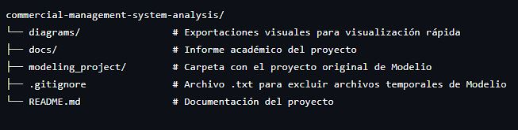
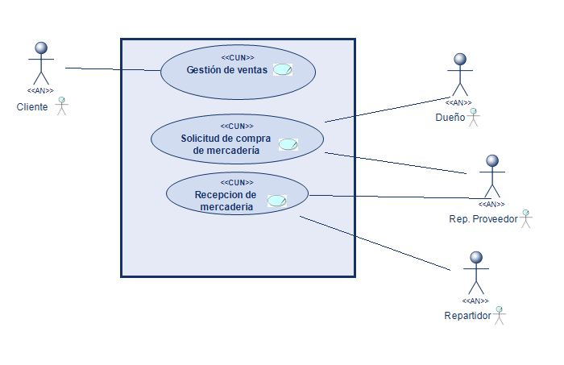
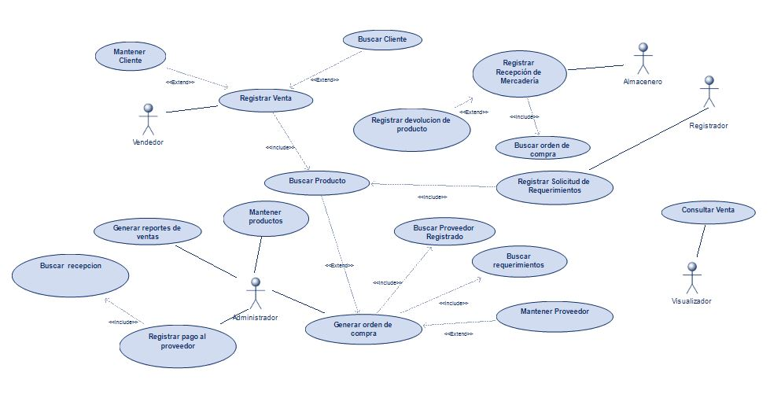
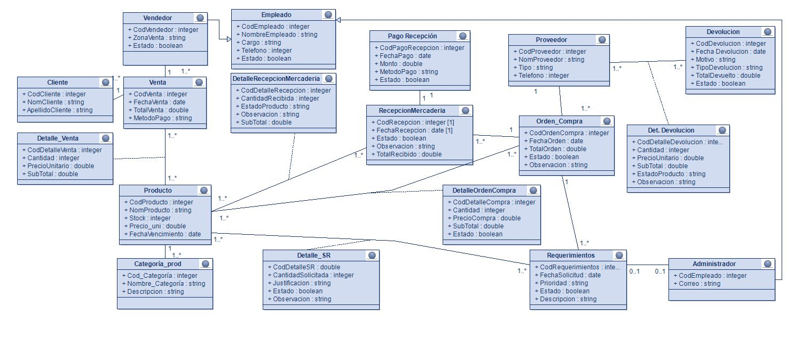
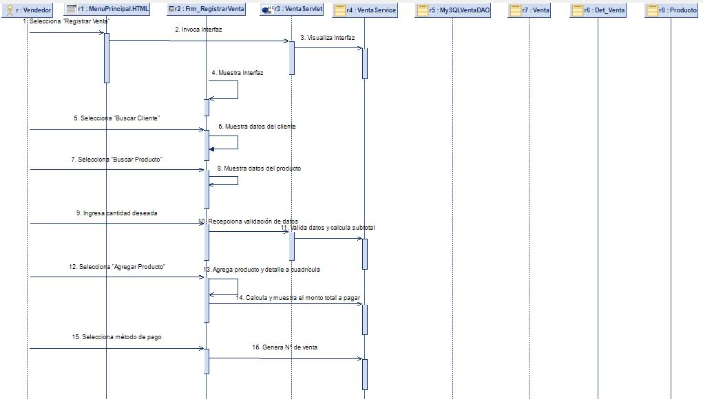
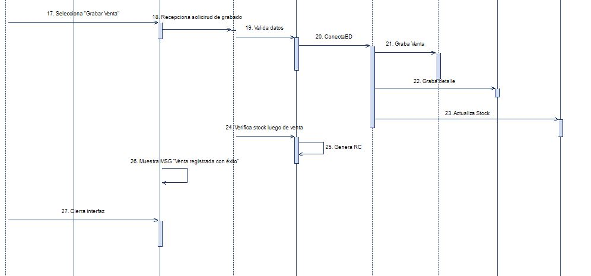
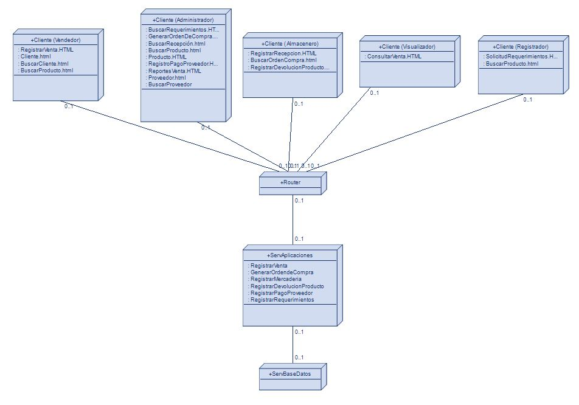

# 🏪 commercial-management-system-analysis

  
  
  

Este proyecto presenta el análisis, diseño y modelado de procesos de negocio para optimizar la gestión de inventario, ventas y compras de una bodega local. Desarrollado como parte del proyecto universitario para la asignatura de **Diseño y Arquitectura de Software** (Ciclo VII).

## 🎯 Objetivos del Proyecto
* **Optimizar procesos:** Rediseñar el flujo de ventas e inventario para reducir mermas.
* **Automatización:** Proponer un modelado robusto que sirva como base para el posterior desarrollo de un sistema de software.
  
## 📂 Estructura del Repositorio

## 🛠️ Tecnologías y Herramientas Utilizadas
* **Herramienta de Modelado:** Modelio 5.x (UML / BPMN).
* **Gestión de Requerimientos:** Casos de Uso UML.
* **Documentación:** Markdown, Microsoft Word (Informe adjunto).

## 📊 Arquitectura y Diagramas Clave

  1. Diagrama General de Caso de Uso del Negocio (CUN):
  Representación de los procesos de negocio clave de la bodega y los actores externos que interactúan con ellos.
  

  2. Diagrama General de Caso de Uso del Sistema (CUS):
  Define el límite del sistema de software propuesto, detallando cómo los diferentes roles de usuario (Cajero, Administrador, etc.) interactúan con las funcionalidades de la aplicación para automatizar los procesos de la bodega.
  

  3. Modelo Conceptual:
  Abstracción del dominio del problema que representa las entidades clave del negocio de la bodega, sus atributos principales y las relaciones lógicas existentes entre ellos.
  

  4. Diagrama de Secuencia (Flujo Básico)(Caso de Uso: **Registrar Venta**):
  Muestra de Diseño Detallado del flujo de interacción y ciclo de vida de los objetos del sistema durante el escenario ideal de la transacción.
  
  

  5. Diagrama de Despliegue y Componentes:
  Representación de la arquitectura física y lógica del sistema, ilustrando la distribución de los componentes de software (frontend, backend, base de datos) en los nodos de hardware correspondientes.
  

## 🚀 Cómo Visualizar el Proyecto de Modelado
1. Descarga e instala **Modelio Open Source**.
2. Clona este repositorio: `git clone https://github.com/tu-usuario/tu-repositorio.git`
3. Comprime a .zip la carpeta `/modeling_project`
4. Abre Modelio e importa la carpeta comprimida .zip `/modeling_project` como un proyecto existente.

## 👥 Colaboradores

Este proyecto fue desarrollado con fines académicos de manera colaborativa por estudiantes de Ingeniería de Sistemas (puede encontrarlos en el informe del proyecto).
El repositorio se publica como muestra de portafolio con el reconocimiento correspondiente al trabajo en equipo.
Mi participación estuvo enfocada en el análisis y diseño, siendo responsable directo de la elaboración de los siguientes artefactos clave:
* **Modelado del Negocio:**
  * Diagrama General de Caso de Uso del Negocio (CUN).
  * Diagramas de Realización del Negocio (módulos seleccionados).
* **Ingeniería de Requisitos:**
  * Tabla con los Requisitos del Sistema (Funcionales y No Funcionales).
  * Diagrama General de Caso de Uso del Sistema (CUS).
* **Análisis y Diseño de Software:**
  * Diagrama General de Caso de Uso del Sistema según el análisis.
  * Diagramas de Análisis de Clases (módulos seleccionados).
  * Diagramas de Clases del Diseño (módulos seleccionados).
  * Diagramas de Comunicación - Flujo Básico (módulos seleccionados).
  * Diagramas de Secuencia - Flujo Básico (módulos seleccionados).
